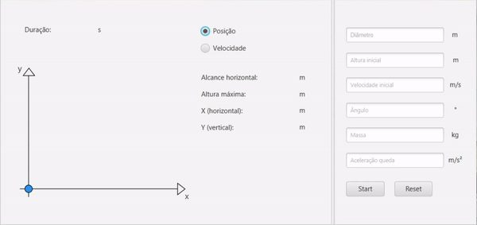

<!-- ---------------------------------- Tituo ---------------------------------- -->
<h1 align="center">Movimento-Projetil-Fisica</h1>

<!-- ---------------------------------- Status ---------------------------------- -->
<p align="center"><b>Status:</b> Versão inicial completa. Pode haver novas versões futuramente.</p>

<!-- ---------------------------------- Sumario ---------------------------------- -->
<h2 align="center">Sumário</h2>
<p>
 <a href="#pré-visualização">Pré-visualização</a> •
 <a href="#resumo">Resumo</a> •
 <a href="#descricao">Descrição</a> •
 <a href="#tecnologia">Tecnologia</a> •
 <a href="#pré-requisitos">Pré-requisitos</a> •
 <a href="#download">Download</a> •
 <a href="#autor">Autor</a> •
</p>

<!-- ---------------------------------- Pré-visualização ---------------------------------- -->
<h2 align="center">Pré-visualização</h2>
<p id="pré-visualização" align="center">
 
</p>

<!-- ---------------------------------- Resumo ---------------------------------- -->
<!-- Resumo -->
<h2 align="center">Resumo</h2>

<p id="resumo">Este é um simulador de movimento de projétil desenvolvido em Java, que permite visualizar e calcular a trajetória de um projétil em diferentes situações. Levando em consideração variáveis como a massa, altura de lançamento, ângulo de lançamento, velocidade inicial e aceleração da gravidade. O projeto possui uma interface gráfica de usuário (GUI) amigável e fácil de usar, e foi desenvolvido utilizando conceitos de orientação a objetos e cálculo matemático para garantir um simulador preciso e funcional.</p>

<!-- ---------------------------------- Descrição ---------------------------------- -->
<h2 align="center" id="descricao">Descrição</h2>

<p>O simulador de movimento de projétil é uma ferramenta desenvolvida em Java para auxiliar na visualização e cálculo da trajetória de um projétil em diferentes circunstâncias. O projeto foi criado com o objetivo de fornecer uma ferramenta útil para estudantes, engenheiros e pesquisadores que trabalham com dinâmica de projéteis em diferentes áreas, como balística, mecânica e aerodinâmica.

O simulador é capaz de levar em consideração diversas variáveis que influenciam o movimento do projétil, incluindo a massa, altura de lançamento, ângulo de lançamento, velocidade inicial e aceleração da gravidade. A partir dessas variáveis, o simulador é capaz de calcular e exibir informações como a trajetória, a velocidade horizontal e vertical, a altura máxima atingida, o alcance máximo, posição horizontal e vertical a cada instante e módulo da velocidade.

O projeto foi desenvolvido com base em conceitos de orientação a objetos com Java e utilizando biblioteca JavaFX que usamos para criar a interface gráfica de usuário (GUI) amigável e fácil de usar. O usuário pode inserir os parâmetros desejados e visualizar a trajetória do projétil em tempo real, tornando o processo de aprendizado mais interativo e dinâmico.</p>

<!-- ---------------------------------- Tecnologias ---------------------------------- -->
<h2 align="center" id="tecnologia">Tecnologias</h2>

<p>As seguintes ferramentas foram usadas na construção do projeto:</p>

<ul>
  <li>[Java](https://www.java.com/pt-BR/)</li>
  <li>[JavaFX Scene Builder](https://www.oracle.com/java/technologies/javase/javafxscenebuilder-info.html)</li>
</ul>

<!-- ---------------------------------- Pré requisitos ---------------------------------- -->
<h2 align="center" id="pré-requisitos">Pré-requisitos</h2>

<p>Antes de começar, você vai precisar ter instalado em sua máquina as seguintes ferramentas:</p>

<ul>
  <li>[Java](https://www.java.com/pt-BR/)</li>
  <li>[IDE - Ambiente de desenvolvimento integrado]()</li>
</ul>

<!-- ---------------------------------- Download ---------------------------------- -->
<h2 align="center" id="download">Download</h2>

<p>Para o Download utilize o git para clonar o repositório</p>

```bash
# Clone este repositório
$ git clone <https://github.com/GuilhermeSouzaCunha/Movimento-Projetil-Fisica/>
```

<!-- ---------------------------------- Autor ---------------------------------- -->
<h2 align="center" id="autor">Autor</h2>

<a href="https://github.com/GuilhermeSouzaCunha/"><sub><b>Guilherme de Souza Cunha</b></sub></a> 
<a href="https://github.com/GuilhermeSouzaCunha/">🚀</a>

Feito com ❤️ por Guilherme Cunha 👋🏽 Entre em contato!

[](https://br.linkedin.com/in/guilherme-de-souza-cunha-b6841b267) 
[](mailto:guiscunha123@gmail.com)
